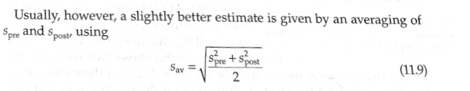

```{r setup, include=FALSE}
knitr::opts_chunk$set(echo = TRUE)
```

# Introduction

### The Cohen's D Problem

Different versions of Cohen's D can yield different result, which is not surprising - they are different versions after all. Different versions and their use case are discussed in @lakens and @statswiki. In this work we are less interested in theoretically discriminating the different versions, which is already pretty well documented, but rather in building the bridge between theory and software implementation. There are more than enough implementations of Cohen's D in R but which functions are equivalent and how do they map to the theoretical different versions of Cohen's D?

The main formula as stated by Cohen is as follows:

$$d = \frac{M_1 - M_2}{SD},$$

where $M_i$ is the mean in group $i$ and SD is the estimate for the standard deviation.

It serves as a standardized effectsize for the difference in means. The comparison can either be made within- or between groups, which is why there is a need for different versions. The main building blocks stay the same in all versions of Cohen's D that we present: There are always two means and an estimate for the standard deviation. The only thing that changes is the estimator used to estimate the SD.

Different versions of Cohen's D can be categorised based on the estimator that are used to estimate the SD in the formula as described in the vignette of the effectsize package (@effectsize) and @lakens.

### Goals of this project

-   Define different versions of Cohen's D and map each implementation to one of these categories.

-   Compare point estimates and confidence intervals for different simulated datasets within groups.

-   What is the input format? Do we give in the raw data or manually input the means and standard deviations?

-   How user-friendly are the implementations? Does the used know which version he/she uses or is it rather ambiguous for someone that does not go into the source code. For the implementations that do not describe well what is used, show via simulation the introduced bias that could arise, depending on different designs.

$\texttt{Disclaimer:}$ At the moment, this work is not about judging the respective properties and use cases of the different versions of Cohen's D. The same goes for different methods to construct confidence intervals for the effect size.

# Theory

### Notation

I will use the following notation:

$V_i :=$ Variance of group $i \in \{1,2\}$

$\bar{X}_i :=$ Mean of group $i \in \{1,2\}$

$\bar{X}_{ij} :=$ Mean of individual $j \in \{1,..,n\}$ in group $i \in \{1,2\}$

$x_{ijk} :=$ Obervation $k$ of individual$j \in \{1,..,n\}$ in group $i \in \{1,2\}$

$d:=$ Cohens' D estimate

$j:=$ hedges correction factor

$d\cdot j = g :=$ Hedges' G estimate

$\delta :=$ true effect

$\sigma^2:=$ variance of the estimator

\$df = n_1+n_2-2 := \$ Degrees of freedom

### Different Versions of Cohen's D

Different versions of Cohen's D can be distinguished based on the estimator used to estimate the standard deviation in the formula. There is a distinction to be made about wether a particular estimator is used in a within- or between design. In general $d_s$ is proposed to serve between subject comparisons, while $d_z$ and $d_{rm}$ are used for within subject comparisons. Both $d_{avg}$ and $d_b$ have been described in both settings afaik. I do not describe the distinction of the nominator between the two cases (within/between) as they should be the same when $n_1=n_2$: [Add more here]

\begin{align}
M \text{(between)} &= \bar{X}_1 - \bar{X}_2 \\ 
  &= \frac{1}{n_1} \sum x_{1i} - \frac{1}{n_2} \sum x_{2j}  && \text{(Definition of sample means)} \\ 
  &= \frac{1}{n} \sum \sum (x_{1i} - x_{2j}) && \text{(Expanding both sums into a single sum bc $n_1 = n_2$)} \\ 
  &= \frac{1}{n} \sum (x_{1i} - x_{2i}) && \text{(Pairing elements from both groups using $i=j$)} \\
  &= M \text{(within)}
\end{align}

$\texttt{Versions:}$

$d_s: SD = \sqrt{\frac{(n_1-1)\cdot SD_1^2 + (n_2 -1)\cdot SD^2_2}{n_1 + n_2-2}}$

$d_{avg}: SD = {\sqrt{\frac{SD_1^2 + SD^2_2}{2}}}$

$d_z: SD = \sqrt{SD_1^2+SD_2^2-2rSD_1SD_2}$

$d_{rm}: SD = SD_z\cdot \sqrt{2(1-r)}$

$d_b: SD = SD_{control}$

### Hedges' G

For sample sizes below 20, Hedges’ g corrects the bias introduced by the standard formulation of Cohen’s d, as the latter is not an unbiased estimator of the standardized mean difference in such cases. For sample sizes above this threshold, there is no significant difference between the two measures.

There are different ways to calculate the hedges correction ($j$):

$\texttt{Option I (Exact):}$

$$j = \frac{\Gamma(\frac{df}{2})}{\sqrt{\frac{df}{2}}\cdot \Gamma(\frac{df-1}{2})}$$

$\texttt{Option II (Approximation):}$

$$j = 1-\frac{3}{4(n_1 + n_2)-9} = 1-\frac{3}{4df-1}$$

For the case of simplicity I will not distinguish the two in the following work. This should not matter for the comparison of the different implementations but can explain slight deviations in the results (talking many digits behind the zero here).

### Variance of the Estimator

There are two main methods to construct a confidence interval for the estimate of the standardised mean difference. We will see that there are many slight deviations from these two methods, which can lead to different results. Hedges himself wrote that "In small samples, the estimator $g$ of effect size has a sampling distribution that is a constant times the noncentral t distribution. When the samples sizes in the experimental and control groups are large, however, the asymptotic distribution of $g$ provides a satisfactory approximation to the exact distribution of $g$.

$\texttt{Option I (large sample):}$

This is what Hedges proposed for the large sample case. He writes (I changed the notation to match what I use): "This large-sample approximation is used by substituting an estimator of the effect size for $\delta$ in (8). In the case of a single effect size, we substitute $g$ for $\delta$ in (8) to obtain an expression for the variance of $g$."

The equation 8 he refers to is the following:

$$\sigma^2 = \frac{1}{n_1}+\frac{1}{n_2}+\frac{\delta^2}{2(n_1+n_2)}$$

Therefore we can plug our estimate $g$ into the equation to get the variance of the estimator:

$$\sigma^2 = \frac{1}{n_1}+\frac{1}{n_2}+\frac{g^2}{2(n_1+n_2)}$$ The sampling distribution of $g$ is approximately normal with mean $g$ and variance $\sigma^2$, therefore the standard error of $g$ is $\sqrt{\sigma^2}$ and the Wald confidence interval is constructed as $g \pm z_{0.975}\cdot \sqrt{\sigma^2}$.

Note, sometimes the expression for the variance it is also written as $\sigma^2=\frac{n_1+n_2}{n_1n_2}+\frac{\delta^2}{2(n_1+n_2)}$, which is equivalent to the expression above because $\frac{x+y}{xy}=\frac{x}{xy}+\frac{y}{xy} = \frac{1}{y} + \frac{1}{x}$ holds in general.

$\texttt{Option II (small sample):}$

From the [effectsize vignette](https://easystats.github.io/effectsize/reference/effectsize_CIs.html): "Using the noncentrality parameter method (also called the "pivot method"). This method finds the noncentrality parameter ("ncp") of a noncentral t, F, or $\chi^2$ distribution that places the observed t, F, or $\chi^2$ test statistic at the desired probability point of the distribution. For example, if the observed t statistic is 2.0, with 50 degrees of freedom, for which cumulative noncentral t distribution is t = 2.0 the .025 quantile (answer: the noncentral t distribution with ncp = .04)? After estimating these confidence bounds on the ncp, they are converted into the effect size metric to obtain a confidence interval for the effect size (Steiger, 2004). Steiger, J. H. (2004). Beyond the F test: Effect size confidence intervals and tests of close fit in the analysis of variance and contrast analysis."

[Expand the details on this]

At the moment I omit judging their respective properties and use cases as this is more about the differences in implementation in the first step.

# Implementation

I simulate this very basic set-up in order to implement the different functions and to flag differences the estimate between the functions which I try to explain by looking at the source code. The data is generated as follows:

```{r}
# Example: Two independent samples gr1 and gr2
set.seed(123)
n    <- 100
m1   <- 6
sd1  <- 2
m2   <- 1
sd2  <- 3

gr1 <- rnorm(n, m1, sd1)
gr2 <- rnorm(n, m2, sd2)

# Summaries for each group
m1 <- mean(gr1)
sd1 <- sd(gr1)
n1  <- length(gr1)

m2 <- mean(gr2)
sd2 <- sd(gr2)
n2  <- length(gr2)

r <- cor(gr1, gr2)

df <- data.frame(
  m1 = m1,  # Mean of group 1
  sd1 = sd1,  # SD of group 1
  n1  = n1,   # Sample size of group 1
  m2  = m2,  # Mean of group 2
  sd2 = sd2,  # SD of group 2
  n2  = n2)    # Sample size of group 2

df_raw <- data.frame(
  gr1 = gr1,
  gr2 = gr2) |> 
  tidyr::pivot_longer(cols = c(gr1, gr2), names_to = "group", values_to = "score")
```

$\texttt{Mapping the functions to the different versions of Cohen's D:}$

#### $d_s: SD = \sqrt{\frac{(n_1-1)\cdot SD_1^2 + (n_2 -1)\cdot SD^2_2}{n_1 + n_2-2}}$

-   [`metafor::escalc(measure = "SMD")`](https://github.com/wviechtb/metafor/blob/master/R/escalc.r)
-   [`esc::esc_mean_sd(es = "g")`](https://github.com/strengejacke/esc/blob/master/R/esc_mean_sd.R)
-   [`esci::CI_smd_ind_contrast(assume_equal_variance = T)`](https://github.com/rcalinjageman/esci/blob/master/R/CI_smd_ind_contrast.R)
    -   default: bias correction
    -   $\sigma^2:$ bit more involved (Kelley 2007). Have implemented it below.
-   [`effsize::cohen.d(pooled = TRUE, hedges.correction=TRUE)`](https://github.com/mtorchiano/effsize/blob/master/R/CohenD.R)
    -   default: pooled=TRUE, paired=FALSE, hedges.correction=FALSE
    -   CI based on t-dist (implemented below)
-   [`psych::cohen.d()`](https://rdrr.io/cran/psych/src/R/cohen.d.R)
-   [`MBESS::smd(Unbiased = hedges_correction)`](https://rdrr.io/cran/MBESS/src/R/smd.R)
    -   default: unbiased = FALSE
    -   CI can be computed with ci.smd() (implemented below) using the t-distribution
-   [`lsr::cohensD(method = “corrected”)`](https://rdrr.io/cran/lsr/src/R/cohensD.R)
-   `effectsize::cohens_d(pooled_sd = TRUE)`
-   `effectsize::repeated_measures_d(method = “d”)`

#### $d_{avg}: SD = {\sqrt{\frac{SD_1^2 + SD^2_2}{2}}}$

-   [`metafor::escalc(measure = "SMDH", vtype="LS")`](https://github.com/wviechtb/metafor/blob/master/R/escalc.r)
-   [`esci::CI_smd_ind_contrast(assume_equal_variance = F)`](https://github.com/rcalinjageman/esci/blob/master/R/CI_smd_ind_contrast.R)
-   `effectsize::repeated_measures_d(method = “av”)`
-   [`lsr::cohensD(method = “unequal”)`](https://rdrr.io/cran/lsr/src/R/cohensD.R)

#### $d_z: SD = \sqrt{SD_1^2+SD_2^2-2rSD_1SD_2}$

-   [`esc::esc_mean_sd(r=r, es = "g")`](https://github.com/strengejacke/esc/blob/master/R/esc_mean_sd.R)
-   [`lsr::cohensD(method = “paired”)`](https://rdrr.io/cran/lsr/src/R/cohensD.R)

#### $d_{rm}: SD = SD_z\cdot \sqrt{2(1-r)}$

-   [`effsize::cohen.d(paired = TRUE, pooled = TRUE, hedges.correction = FALSE)`](https://github.com/mtorchiano/effsize/blob/master/R/CohenD.R)
    -   default: pooled=TRUE, paired=TRUE, hedges.correction=FALSE
    -   CI based on t-dist (implemented below)
-   `effectsize::repeated_measures_d(method = “rm”)`

#### $d_b: SD = SD_{control}$

-   [`metafor::escalc(measure = "SMD1", vtype="LS")`](https://github.com/wviechtb/metafor/blob/master/R/escalc.r)
    -   default: bias correction, $\sigma^2$ estimator (vtype): "LS"
    -   $\sigma^2 (LS) = \frac{1}{n_1}+\frac{1}{n_2}+\frac{g^2}{2(n_1+n_2)}$ (Hedges, 1982)
    -   CI: not provided
-   `effectsize::repeated_measures_d(method = “b”, adjust = hedges_correction)`

$\texttt{Describing the implementations in detail:}$

## Metafor (4.9-0)

### Options

$d_s \rightarrow$ `measure = "SMD"`

$d_z \rightarrow$ `measure = "SMDH"`

$d_b \rightarrow$ `measure = "SMD1"`

### Variance

The metafor package does not provide a confidence interval for the effect size but offers several options to calculate the sampling variance using the `vtype` parameter.

$\texttt{SMD (d_s) & SMD1 (d_b)}$

-   `vtype = "LS"` (default): This is the large sample case and equivalent to Option I, : $\frac{1}{n_1} + \frac{1}{n_2} + \frac{g^2}{2(n_1+n_2)}$
-   `vtype = "LS2"`: Alternative large sample approximation to the sampling variance: $j^2 \cdot \left(\frac{1}{n_1} + \frac{1}{n_2} + \frac{d^2}{2(n_1+n_2)}\right)$ as described in Borenstein, 2009, equation 12.17
-   `vtype = "UB"`: $\frac{1}{n_1} + \frac{1}{n_2} + (1 - \frac{df-2}{df\cdot j^2}) \cdot g^2$ as described in Hedges 1983, equation 9

The others are not relevant for this work as they are only applicable for meta-analyses.

$\texttt{SMDH (d_z)}$

-   `vtype = "LS"` (default): This is the estimator described in Bonett, 2009, equation 5: $d^2 \cdot \frac{\frac{SD_1^4}{n_1-1} + \frac{SD_2^4}{n_2-1}}{8\cdot SD^4} + \frac{SD_1^2}{SD^2(n_1-1)} + \frac{SD_2^2}{SD^2(n_2-1)}$. They implement $g$ instead of $d$ (deliberate).
-   `vtype = "LS2"`: This is a alternative large sample approximation to the sampling variance (using $n$ instead of $n-1$): $d^2 \cdot \frac{\frac{SD_1^4}{n_1} + \frac{SD_2^4}{n_2}}{8\cdot SD^4} + \frac{SD_1^2}{SD^2(n_1)} + \frac{SD_2^2}{SD^2(n_2)}$

### Code

`metafor::escalc()`

The user specifies the `measure` parameter to determine which version of Cohen's D should be calculated. The `vtype` parameter is used to determine the variance estimator that should be used. The default is `vtype="LS"` which is equivalent to Option I. In the most recent update they added the parameter `correct` which can be used to determine whether hedges correction should be applied. The default is `correct = TRUE` which applies the hedges correction.

$\texttt{SMD (d_s)}$: `metafor::escalc(measure="SMD")`

```{r}
metafor_s <- metafor::escalc(measure="SMD",
                                  m1i=m1, 
                                  sd1i=sd1, 
                                  n1i=n1,
                                  m2i=m2, 
                                  sd2i=sd2, 
                                  n2i=n2,
                                  vtype="LS")

est_metafor_s <- metafor_s$yi
sd_metafor_s <- sqrt(metafor_s$vi)
setNames(est_metafor_s + qnorm(0.975) * c(-1, 0, 1) * sd_metafor_s, 
         c("Lower CI", "Effect Size", "Upper CI"))
```

$\texttt{SMDH (d_z)}$: `metafor::escalc(measure="SMDH")`

```{r}
metafor_z <- metafor::escalc(measure="SMDH",
                                  m1i=m1, 
                                  sd1i=sd1, 
                                  n1i=n1,
                                  m2i=m2, 
                                  sd2i=sd2, 
                                  n2i=n2,
                                  vtype="LS")

est_metafor_z <- metafor_z$yi
sd_metafor_z <- sqrt(metafor_z$vi)
setNames(est_metafor_z + qnorm(0.975) * c(-1, 0, 1) * sd_metafor_z, 
         c("Lower CI", "Effect Size", "Upper CI"))
```

$\texttt{SMD1 (d_b)}$: `metafor::escalc(measure="SMD1")`

```{r}
metafor_b <- metafor::escalc(measure="SMD1",
                                  m1i=m1, 
                                  n1i=n1,
                                  m2i=m2, 
                                  sd2i=sd2, 
                                  n2i=n2,
                                  vtype="LS")

est_metafor_b <- metafor_s$yi
sd_metafor_b <- sqrt(metafor_s$vi)
setNames(est_metafor_s + qnorm(0.975) * c(-1, 0, 1) * sd_metafor_s, 
         c("Lower CI", "Effect Size", "Upper CI"))
```

## Esc (0.5.1)

### Options

$d_s \rightarrow$ `es.type = "g"`

$d_z \rightarrow$ `es.type = "g, r = r"`

### Variance

Both functions use the same variance estimator (Option I), with the exception that they use $d$ instead of $g$ in the formula, which yields the Variance for the uncorrected estimate. Therefore, this variance estimate does not exactly match what we observe in the metafor package. This is described in the [source code](https://rdrr.io/cran/esc/src/R/esc_helper.R) for the helper functions.

$$\sigma^2 = \frac{1}{n_1} + \frac{1}{n_2} + \frac{d^2}{2(n_1+n_2)}$$
The CI is calculated as $d \pm z_{0.975}\cdot \sqrt{\sigma^2}$.

### Code

$\texttt{d_s:}$ `esc::esc_mean_sd(es.type = "g")`

```{r}
esc_s <- esc::esc_mean_sd(grp1m  = m1,
                 grp1sd = sd1,
                 grp1n  = n,
                 grp2m  = m2,
                 grp2sd = sd2,
                 grp2n  = n,
                 es.type = "g")

setNames(c(esc_s[["ci.lo"]], esc_s[["es"]], esc_s[["ci.hi"]]), 
         c("Lower CI", "Effect Size", "Upper CI"))
```

$\texttt{d_z:}$ `esc::esc_mean_sd(r = r, es.type = "g")`

```{r}
esc_z <- esc::esc_mean_sd(grp1m  = m1,
                 grp1sd = sd1,
                 grp1n  = n,
                 grp2m  = m2,
                 grp2sd = sd2,
                 grp2n  = n,
                 r = r, 
                 es.type = "g")

setNames(c(esc_z[["ci.lo"]], esc_z[["es"]], esc_z[["ci.hi"]]), 
         c("Lower CI", "Effect Size", "Upper CI"))
```

## psych (2.4.6.26)

### Options

$d_s$

### Variance

Creates the Confidence interval based on the t-distribution. I think this is the same as Option II. Will confirm this as soon as I have desribed Option II in more detail.

### Code

As we can see in the code below, the hedges correcion is not really applied as it should. They basically just change $n$ to $n-2$ without actually applying the hedges correction. This is why the point estimate is not comparable to other implementations.

They basically do this:

-   If no hedges correction they use this, which is the biased pooled standard deviation: $\sqrt{\frac{(n_1-1)\cdot SD_1^2 + (n_2 -1)\cdot SD^2_2}{n_1 + n_2}}$
-   When applying hedges correction, they just use the unbiased pooled standard deviation: $\sqrt{\frac{(n_1-1)\cdot SD_1^2 + (n_2 -1)\cdot SD^2_2}{n_1 + n_2-2}}$, which is not what the hedges correction really is.

Also, they implement $\bar{X_2}-\bar{X_1}$ instead of $\bar{X_1}-\bar{X_2}$, which is why the point estimate is negative.

This chunk is directly copied from the source code:

```{r, eval=F}
d <- stats$mean[2,] - stats$mean[1,]   #this is a vector differerences
sd.p <- sqrt((( (stats$n[1,]-1) * stats$sd[1,]^2) + (stats$n[2,]-1) * stats$sd[2,]^2)/(stats$n[1,]+stats$n[2,])) #if we subtract 2 from n, we get Hedges g
sd.ph <- sqrt((((stats$n[1,]-1) * stats$sd[1,]^2) + (stats$n[2,]-1) * stats$sd[2,]^2)/(stats$n[1,]+stats$n[2,]-2)) #if we subtract 2 from n, we get Hedges g
n <- stats$n[1,]+ stats$n[2,]   #this is a vector of ns taken from the statsBy function

cohen.d <- d/sd.p

hedges.g <- d/sd.ph
```

```{r}
psych_s <- psych::cohen.d(df_raw~group)

setNames(c(psych_s$hedges.g[1], psych_s$hedges.g[2], psych_s$hedges.g[3]), 
         c("Lower CI", "Effect Size", "Upper CI"))
```

## Esci

### Options

### Variance

### Code

## MBESS 

### Options

### Variance

### Code

## lsr (0.5.2)

### Options

$d_s \rightarrow$ `method = "corrected"`

$d_{avg} \rightarrow$ `method = "unequal"`

$d_z \rightarrow$ `method = "paired"`

### Variance

There is no variance estimate available.

### Code

Important to note is that the hedges correction is only available for $d_s$.

$\texttt{d_s:}$ `lsr::cohensD(method = "corrected")`

```{r}
lsr::cohensD(gr1, gr2, method = "corrected")
```

$\texttt{d_{avg}:}$ `lsr::cohensD(method = "unequal")`

```{r}
lsr::cohensD(gr1, gr2, method = "unequal")
```

$\texttt{d_z:}$ `lsr::cohensD(method = "paired")`

```{r}
lsr::cohensD(gr1, gr2, method = "paired")
```


## effsize

### Options

### Variance

### Code

## effectsize (1.0.0)

### Options

$d_s \rightarrow$ `effectsize::cohens_d(pooled_sd = TRUE)`

$d_s \rightarrow$ `effectsize::repeated_measures_d(method = “d”)`

$d_{avg} \rightarrow$ `effectsize::repeated_measures_d(method = “av”)`

$d_z \rightarrow$ `effectsize::repeated_measures_d(method = “z”)`

$d_{rm} \rightarrow$ `effectsize::repeated_measures_d(method = “rm”)`

$d_b \rightarrow$ `effectsize::repeated_measures_d(method = “b”)`

### Variance


$\texttt{d_rm:}$

$\sigma^2 = \frac{\frac{1}{n} + g^2}{2n}\cdot g$ as described in Cooper et al., 2009, eq 12.21

$\texttt{d_z:}$

$\sigma^2 = \frac{1}{n} + \frac{g^2}{2n}$ as described in Hedges, L. V. & Olkin, I. (1985). Statistical methods for meta-analysis. Orlando, FL: Academic Press., which I cannot access unfortunately.

$\texttt{d_avg:}$

$\sigma^2 = \frac{2(SD_1^2+SD_2^2-2Cov(X,Y))}{n(SD_1^2+SD_2^2)}$ as descibed in Algina et al., 2003, eq 4

$\texttt{d_b:}$

$\sigma^2 = \frac{2 (1 - r)}{n} + \frac{d^2}{2n}$ as described in Becker (1988), eq 6. I think the correct formula would have been $\frac{2 (1 - r)}{n} + \frac{d^2}{2(n-1)}$.


### Code

$\texttt{d_s:}$

```{r}

```

```{r}

```


## Rest of code

`esci::CI_smd_ind_contrast(assume_equal_variance = T, correct_bias = T)`

```{r}
result_esci_s <- esci::CI_smd_ind_contrast(
  means = c(m1, m2),
  sds = c(sd1, sd2),
  ns = c(n,n),
  contrast = contrast <- c(1, -1),
  assume_equal_variance = TRUE,
  correct_bias = TRUE)

setNames(c(result_esci_s[["LL"]], result_esci_s[["effect_size"]], result_esci_s[["UL"]]), 
         c("Lower CI", "Effect Size", "Upper CI"))
```

We can see that the point estimate is the same for this implementation but the CIs differ again. Below I implement the code that was used to construct the CI. Need to describe it in more detail.

```{r}
esciCI <- function(effect_size, contrast, ns, conf_level = 0.95){
  
  dfs <- ns-1
  df <- sum(dfs)
  
  lambda <- effect_size / sqrt(sum(contrast^2/ns)) # Kelley, 2007, equation 60
      
  back_from_lambda <- sqrt(sum(contrast^2/ns)) # Kelley, 2007
      
  lambda_low <- sadists::qlambdap(1/2-conf_level/2, df = df, t = lambda)
  lambda_high <- sadists::qlambdap(1/2+conf_level/2, df = df, t = lambda)

  k <- sqrt(2/df)* exp((lgamma((df+1)/2)) - (lgamma((df)/2)))
  lambda_se <- sqrt(1 + lambda^2 * (1-k^2))
  se <- lambda_se * back_from_lambda

  lower <- lambda_low * back_from_lambda
  upper <- lambda_high * back_from_lambda
  return(setNames(c(lower, effect_size, upper), 
         c("Lower CI", "Effect Size", "Upper CI")))
}

esciCI(effect_size = est_metafor_s,
         contrast = c(1,-1),
         ns = c(n,n))
```

`effsize::cohen.d(paired = FALSE, pooled = TRUE, hedges.correction = TRUE)`

```{r}
d = (c(gr1,gr2))
f = factor(rep(c("Control","Treatment"),each=n), levels=c("Control", "Treatment"),ordered=TRUE)

result_effsize_s <- effsize::cohen.d(d~f, hedges.correction = T, pooled = T, paired = F, noncentral=FALSE)
setNames(c(result_effsize_s[["conf.int"]][["lower"]], result_effsize_s[["estimate"]], result_effsize_s[["conf.int"]][["upper"]]), 
         c("Lower CI", "Effect Size", "Upper CI"))
```

Again, this yields the same point estimate but a different CI. They actually cite a [cool reference](https://daneshnamehicsa.ir/userfiles/files/1/9-%20The%20Handbook%20of%20Research%20Synthesis%20and%20Meta-Analysis.pdf) which proposes the same variance estimate we have seen at the beginning if non_central = FALSE. If non_central = TRUE they use a t distribution, which i need to describe in more detail.

If using the non_central = FALSE option we would expect the same result as we had for the first two implementations, namely `metafor` and `esc`. What they do differently here is to apply the hedges correction again on the variance estimate, which i do not see described in the source they cite. This is why the CI differs again to the other implementations which use the same approach.

```{r}
# I would say that when noncentral = FALSE, this is just the usual hedges again
compute_ncp <- function(t,df,conf.level = 0.95){
  
  st = max(0.1,abs(t))
  end1 = t
  
  while( pt(q=t,df=df,ncp=end1) > (1-conf.level)/2 ){
    
    end1 <- end1 + st
 
    }
  
  ncp1 = uniroot(function(x) (1-conf.level)/2-pt(q=t,df=df,ncp=x),
                 c(2*t-end1,end1))$root
  
  end2 = t
  
  while( pt(q=t,df=df,ncp=end2) < (1+conf.level)/2 ){
    end2 <- end2 - st
  }

  ncp2 = uniroot(function(x) (1+conf.level)/2-pt(q=t,df=df,ncp=x),
                 c(end2,2*t-end2))$root

  return ( c(ncp1=ncp1,ncp2=ncp2) )
}

effsizeCI <- function(d, f, n1, n2, noncentral, conf.level = 0.95) {
  
  m = c()
  s = c()
  
  for(l in levels(f)){
    m = c(m,mean(d[f==l]))
    s = c(s,sd(d[f==l]))
  }
  
  delta.m = as.numeric(m[1] - m[2])
  stdev = sqrt(((n1-1)*sd1^2+(n2-1)*sd2^2)/(n1+n2-2))
  dd = delta.m / stdev
  df = n1+n2-2
  J = 1 - 3 / ( 4 * (n1+n2) - 9)
  dd = dd * J # hedges G (point estimate)
  
  # Confidence Interval #
  
  if(noncentral){
   
    # Based on the document:
    # David C. Howell (2010)
    # Confidence Intervals on Effect Size
    # https://www.uvm.edu/%7Edhowell/methods7/Supplements/Confidence%20Intervals%20on%20Effect%20Size.pdf
    #
    # Additional reference:
    # Cumming, G.; Finch, S. (2001) 
    # A primer on the understanding, use, and calculation of confidence intervals 
    # that are based on central and noncentral distributions. 
    # Educational and Psychological Measurement, 61, 633-649.
    #
    
   s = stdev
   t = delta.m / sqrt(s^2*(1/n1+1/n2))
   ncp = compute_ncp(t,df)
   conf.int=sort(c(ncp[1]*sqrt(1/n1+1/n2),ncp[2]*sqrt(1/n1+1/n2)))
   
  }
  
  else{
      ## Probably the source is incorrect!!
      ## The Handbook of Research Synthesis and Meta-Analysis 
      ## (Cooper, Hedges, & Valentine, 2009)
      ## p 238
      #S_d = sqrt(((n1+n2)/(n1*n2) + .5*dd^2/df) * ((n1+n2)/df))
      
      # Robert J. Grissom and John J. Kim (2005)
      # Effect size for researchers
      # Lawrence Erlbaum Associates
      # Equation 3.13 page 60
    
    S_d = sqrt((n1+n2)/(n1*n2) + .5*dd^2/(n1+n2))
    S_d = S_d * J
    Z = -qt((1-conf.level)/2,df)
    conf.int = c(dd - Z*S_d,
                 dd + Z*S_d)
  }
  
  return(setNames(c(conf.int[1], dd, conf.int[2]), 
         c("Lower CI", "Effect Size", "Upper CI")))
  
}
```


`MBESS::smd(Unbiased = TRUE)`

```{r}
result_mbess_s <- MBESS::smd(Mean.1 = m1, 
           Mean.2 = m2, 
           s.1 = sd1, 
           s.2 = sd2, 
           n.1 = n1, 
           n.2 = n2, 
           Unbiased = TRUE)

t <- stats::t.test(score ~ group, data = df_raw)$statistic
  
cis <- MBESS::ci.smd(ncp = t, 
                #smd = result_mbess_s, 
                n.1 = n1, 
                n.2 = n2, 
               Unbiased = TRUE)

setNames(c(cis$Lower.Conf.Limit.smd, cis$smd, cis$Upper.Conf.Limit.smd), 
         c("Lower CI", "Effect Size", "Upper CI"))
```

If I plug in the result from the t-test for the ncp parameter, this yields the same CI as `effsize(noncentral = TRUE)`, but the SMD is not the correct one (have to look into this).

This is what is implemented:

```{r, eval=FALSE}
if(length(smd)==1)
{
#if(smd==0) stop("You need not use a noncentral method since the effect size is zero; use the critical value from the central t-distribution.", call.=FALSE)
ncp <- smd*sqrt((n.1*n.2)/(n.1+n.2))
Limits <- conf.limits.nct(ncp, df, conf.level=conf.level, alpha.lower=alpha.lower, alpha.upper=alpha.upper, tol=tol, ...)
Limits.L <- Limits$Lower.Limit
Limits.U <- Limits$Upper.Limit
Lower.Conf.Limit <- Limits.L*sqrt((n.1+n.2)/(n.1*n.2))
Upper.Conf.Limit <- Limits.U*sqrt((n.1+n.2)/(n.1*n.2))
Result <- list(Lower.Conf.Limit.smd=Lower.Conf.Limit, smd=smd, Upper.Conf.Limit.smd=Upper.Conf.Limit)
return(Result)
}
```


`effectsize::cohens_d(pooled_sd = TRUE)`

`effectsize::repeated_measures_d(method = “d”)`

### $d_{avg}$

`esci::CI_smd_ind_contrast(assume_equal_variance = F, correct_bias = T)`

```{r}
result_esci_avg <- esci::CI_smd_ind_contrast(
  means = c(m1, m2),
  sds = c(sd1, sd2),
  ns = c(n,n),
  contrast = contrast <- c(1, -1),
  assume_equal_variance = FALSE,
  correct_bias = TRUE)

setNames(c(result_esci_avg[["LL"]], result_esci_avg[["effect_size"]], result_esci_avg[["UL"]]), 
         c("Lower CI", "Effect Size", "Upper CI"))
```

#### Average Variance

As suggested by @cumming, $d_{av}$ is defined as standardizing by the average variance of the two paired conditions. Note, Lakens writes it a bit differently, he takes the mean of the standard deviations while citing the formula from Cumming, not sure why he does that because this yields a different result in general. Here an excerpt of the book as it is not open access:



$$d_{av} = \frac{\frac{1}{n}\sum_{j=1}^{n}\bar{X}_{1j} - \bar{X}_{2j}}{\sqrt{\frac{V_1 + V_2}{2}}}$$

# Differences between the implementations

# References
